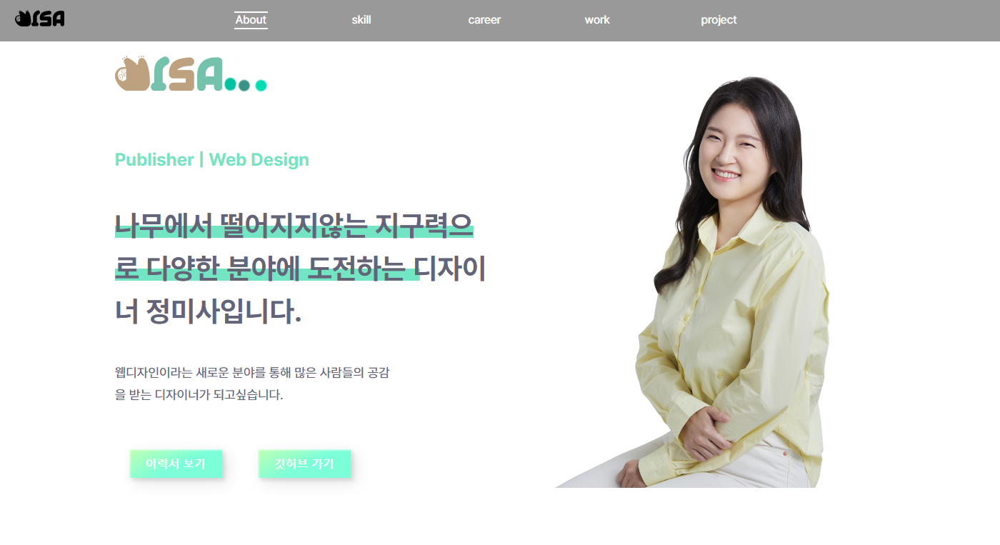
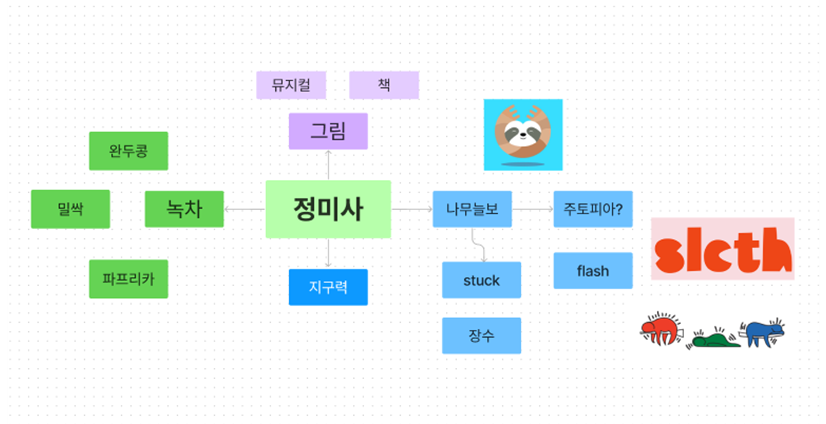
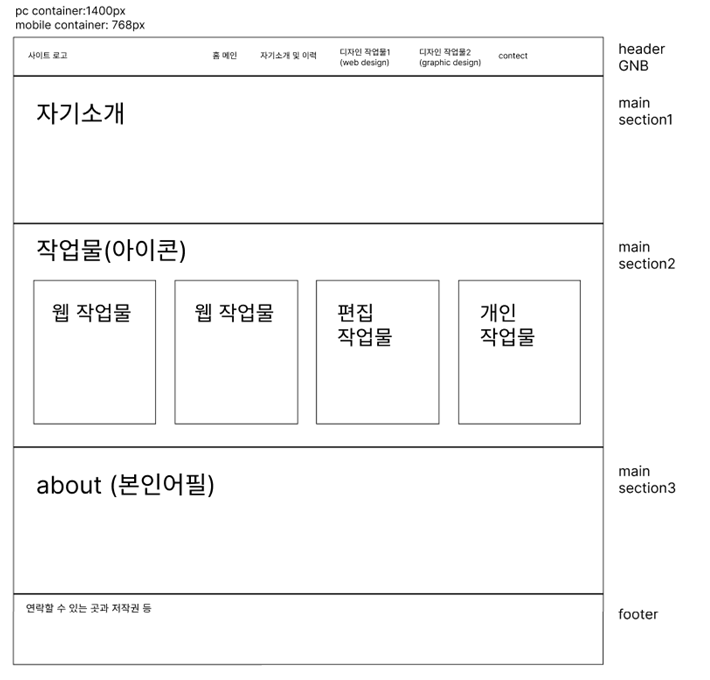

# 미사의 포트폴리오
<!-- 샵으로 시작하면 타이틀 6개쓰면 h6 -->

> 미사의 포트폴리오


5달동안 UI/UX 웹디자인 공부를 하며 쌓은 기록을 포트폴리오로 정리한 사이트입니다.



## 호환성

    OS X & 리눅스:

    ```sh
    npm install my-crazy-module --save
    ```


    윈도우:

    ```sh
    edit autoexec.bat
    ```

## 기술사양

HTML ver5 / CSS Ver3 / JQUERY / JAVASCRIPT / BOOTSTRAP Ver5 

## 마인드맵


> 저를 브랜딩하여 로고 및 포트폴리오를 만들기 위해 마인드맵을 통하여 키워드를 도출해냈습니다.

## 스타일가이드


> 마인드맵과 무드보드를 통해 도출해낸 단어와 이미지를 통해 색상과 키워드를 지정하였습니다. 이 색상과 키워드는 제 브랜드를 나타내는 로고를 만드는 데에도 사용되었습니다.

## 와이어프레임 스케치


## 프로토타입


## 업데이트 내역

- 0.2.1
  - 수정: 문서 업데이트 (모듈 코드 동일)
- 0.2.0
  - 수정: `setDefaultXYZ()` 메서드 제거
  - 추가: `init()` 메서드 추가
- 0.1.1
     \* 버그 수정: `baz()` 메서드 호출 시 부팅되지 않는 현상 (@컨트리뷰터 감사합니다!)
- 0.1.0
  - 첫 출시
  - 수정: `foo()` 메서드 네이밍을 `bar()`로 수정
- 0.0.1
  - 작업 진행 중

## 정보

이름 – [@트위터 주소](https://twitter.com/dbader_org) – 이메일주소@example.com

XYZ 라이센스를 준수하며 `LICENSE`에서 자세한 정보를 확인할 수 있습니다.

[https://github.com/yourname/github-link](https://github.com/dbader/)